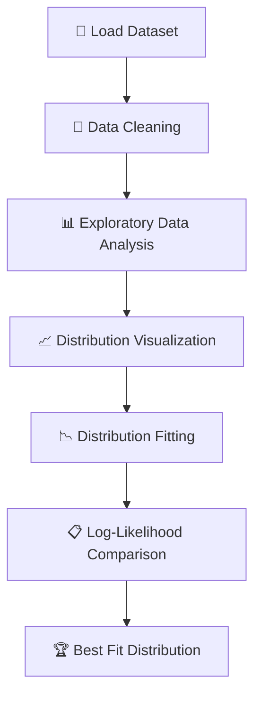

<div align="center">

# 📊 Statistical Distribution Analysis Model

### *From Statistical Theory to Practical Distribution Modeling using Python*

<p align="center">


</p>

---

### 📖 Learn • 📊 Analyze • 📈 Visualize • 📉 Compare

A complete project that explains the fundamentals of statistical distributions and demonstrates their practical implementation through Python, statistical modeling, distribution fitting, and data visualization.

<br>

<a href="#notebook-walkthrough">

</a>

<a href="Statistical_Distribution_Analysis_Model.ipynb">

</a>

<a href="spread_locator_dataset.csv.csv">

</a>

</div>

---

# 🌟 Overview

> **Statistical Distribution Analysis Model** is a complete learning project designed to bridge the gap between statistical theory and real-world implementation.

The project is divided into two major sections:

| 📚 Section | Description |
|------------|-------------|
| 📖 Theory | Covers probability distributions, Q-Q plots, Bernoulli, Binomial, Log-Normal, Power Law, Poisson, Box-Cox transformation, Z-score, PDF vs CDF, and their practical importance. |
| 💻 Practical | Demonstrates statistical distribution analysis using Python on a real transaction dataset, including exploratory analysis, visualization, model fitting, and likelihood comparison. |

---

# ✨ Project Highlights

<table>
<tr>

<td width="33%" align="center">

### 📖 Theory

A complete explanation of statistical distributions with formulas, intuition, and Python-based examples.

</td>

<td width="33%" align="center">

### 💻 Practical

Hands-on implementation with Python, Pandas, NumPy, SciPy, and Matplotlib.

</td>

<td width="33%" align="center">

### 📈 Analysis

Visualize data, fit distributions, compare likelihoods, and identify the best model.

</td>

</tr>
</table>

---

# 🚀 Key Features

| Feature | Status |
|----------|:------:|
| 📖 Beginner-friendly theory | ✅ |
| 📊 Statistical distribution analysis | ✅ |
| 📈 Distribution visualization | ✅ |
| 📉 Distribution fitting | ✅ |
| 📋 Log-likelihood comparison | ✅ |
| 📦 Real transaction dataset | ✅ |
| 🐍 Python implementation | ✅ |
| 💼 Portfolio-ready project | ✅ |

---

# 📑 Table of Contents

- 🌟 Overview
- ✨ Project Highlights
- 📂 Dataset
- 📖 Theory Concepts
- 📊 Workflow
- 💻 Practical Implementation
- 👨‍💻 Author

---

# 📂 Dataset Information

This project uses a transaction dataset to analyze statistical distributions and identify the best-fitting probability model.

## 📌 Dataset Overview

| Property | Details |
|:---------|:--------|
| 📄 Dataset Name | `spread_locator_dataset.csv.csv` |
| 📊 Dataset Type | CSV |
| 📈 Data Category | Transaction and financial-style numerical data |
| 🎯 Analysis Target | `transaction_amount` |
| 💻 Language Used | Python |
| 📚 Libraries | Pandas, NumPy, SciPy, Matplotlib, Seaborn, Statsmodels |

## 📋 Dataset Columns

| # | Column Name | Data Type | Description |
|:-:|-------------|-----------|-------------|
| 1 | `transaction_id` | `object` | Unique transaction identifier. |
| 2 | `customer_id` | `object` | Unique identifier assigned to each customer. |
| 3 | `transaction_amount` | `float64` | Amount used for statistical distribution analysis. |
| 4 | `transaction_date` | `object` | Date of the transaction. |
| 5 | `transaction_count` | `int64` | Number of transactions associated with the customer. |
| 6 | `region` | `object` | Geographic region of the transaction. |
| 7 | `transaction_status` | `object` | Status of the transaction. |

> 🎯 **Primary Analysis Column:** `transaction_amount`  
> This column is used throughout the notebook for distribution fitting, probability analysis, visualization, and log-likelihood comparison.

---

# 📚 Theory Concepts

Understanding statistical distributions is the foundation of data analysis, machine learning, and statistical modeling.

Before performing practical analysis, it is important to understand how different probability distributions behave, when they should be used, and how they help solve real-world problems.

This project covers each concept with definitions, formulas, and Python-based examples.

---

# 📋 Topics Covered

| # | Topic | Description |
|:-:|--------|-------------|
| 01 | 📊 Statistical Distribution | Introduction, types, and applications |
| 02 | 📈 Q-Q Plot | Checking whether data is close to normal |
| 03 | 🎲 Bernoulli Distribution | Probability of binary outcomes |
| 04 | 🎯 Binomial Distribution | Modeling repeated independent trials |
| 05 | 📉 Log-Normal Distribution | Right-skewed continuous distribution |
| 06 | ⚡ Power Law Distribution | Heavy-tailed distribution |
| 07 | 🔄 Box-Cox Transformation | Data normalization technique |
| 08 | 🔢 Poisson Distribution | Modeling count-based events over time |
| 09 | 📏 Z-Score | Standardizing values and spotting outliers |
| 10 | 📈 PDF vs CDF | Understanding probability functions |

---

# 🎯 Learning Outcomes

After completing this project, you will understand:

- ✅ Fundamentals of statistical distributions
- ✅ Difference between discrete and continuous data
- ✅ How probability distributions work in practice
- ✅ How to normalize skewed data with Box-Cox
- ✅ How to compare distributions using visual and quantitative methods
- ✅ How to interpret PDF, CDF, and Q-Q plots
- ✅ How to apply statistics to real transaction data

---

# 🌍 Real-World Applications

The concepts covered here are useful in many industries.

| 🏭 Industry | 📌 Use Case |
|-------------|------------|
| 💰 Finance | Risk analysis and fraud detection |
| 🛒 Retail | Customer purchase and transaction analysis |
| 📊 Data Science | Probability modeling and predictive analysis |
| 🏥 Healthcare | Medical statistics and outcome prediction |
| 🚗 Transportation | Traffic and event-count analysis |
| 🏭 Manufacturing | Quality control and process monitoring |

---

# 📚 Why Learn Statistical Distributions?

<table>

<tr>

<td align="center" width="33%">

### 📊 Analyze Data

Understand how data is distributed before building models or making decisions.

</td>

<td align="center" width="33%">

### 📈 Improve Decision Making

Choose the right statistical method based on the behavior of the data.

</td>

<td align="center" width="33%">

### 🚀 Build Better Models

Improve analysis quality by using appropriate probability distributions.

</td>

</tr>

</table>

---

# 💻 Practical Implementation

The practical implementation demonstrates how statistical distribution concepts are applied to a real transaction dataset using Python.

The complete workflow includes data loading, preprocessing, exploratory data analysis, visualization, statistical fitting, and model evaluation using log-likelihood.

---

## 🎯 Project Workflow



---

# ⚙️ Analysis Workflow

| Step | Process | Status |
|:---:|----------|:------:|
| 01 | 📥 Import required libraries | ✅ |
| 02 | 📂 Load dataset | ✅ |
| 03 | 🔍 Inspect dataset | ✅ |
| 04 | 📊 Explore transaction behavior | ✅ |
| 05 | 📈 Visualize distributions | ✅ |
| 06 | 📉 Fit statistical distributions | ✅ |
| 07 | 📋 Compare log-likelihood scores | ✅ |
| 08 | 🏆 Select best distribution | ✅ |

---

# 🛠️ Technologies Used

| Technology | Purpose |
|------------|---------|
| 🐍 Python | Programming language |
| 🐼 Pandas | Data manipulation |
| 🔢 NumPy | Numerical computation |
| 📊 SciPy | Statistical modeling |
| 📈 Matplotlib | Data visualization |
| 📉 Seaborn | Statistical plotting |
| 📊 Statsmodels | Statistical analysis support |
| 📓 Jupyter Notebook | Development environment |

---

# 📌 Implementation Steps

The notebook is organized into multiple sections to ensure a structured and easy-to-follow analysis workflow.

| Step | Description |
|------|-------------|
| 📦 Step 1 | Import required libraries |
| 📂 Step 2 | Load the dataset |
| 🔍 Step 3 | Explore the dataset |
| 📊 Step 4 | Study Bernoulli and Binomial behavior |
| 📈 Step 5 | Analyze Poisson distribution |
| 📉 Step 6 | Fit Log-Normal and Power Law models |
| 📋 Step 7 | Check normality with Q-Q plot and Shapiro-Wilk test |
| 🔄 Step 8 | Apply Box-Cox transformation |
| 📏 Step 9 | Compute Z-scores and exceedance probability |
| 📈 Step 10 | Plot PDF and CDF |
| 🏆 Step 11 | Compare log-likelihoods and conclude |

---

# 🚀 Notebook Walkthrough

This section provides a structured walkthrough of the complete notebook. Each step includes a short explanation and the corresponding Python code used in the analysis.

> 📌 Tip: Follow the notebook in order to reproduce the same workflow.

---

# 📦 Step 1 — Import Required Libraries

All the essential libraries for data analysis and visualization are imported first.

```python
import numpy as np
import pandas as pd
import matplotlib.pyplot as plt
import seaborn as sns

from scipy import stats
from scipy.stats import bernoulli, binom, poisson, lognorm, powerlaw, norm, zscore
from scipy.stats import boxcox
import statsmodels.api as sm
```

---

# 📂 Step 2 — Load the Dataset

The CSV file is loaded into a Pandas DataFrame.

```python
data = pd.read_csv('spread_locator_dataset.csv.csv')
data.head()
```

> 📸 Output:
 


---

# 📊 Step 3 — Bernoulli and Binomial Analysis

The project uses a binary mapping for transaction success and failure and visualizes the result.

```python
data['status_binary'] = data['transaction_status'].map({'Success': 1, 'Fail': 0})

sns.countplot(x=data['status_binary'])
plt.title('Bernoulli Distribution - Transaction Success/Fail')
plt.xlabel('Transaction Status (0=Fail, 1=Success)')
plt.ylabel('Count')
plt.show()
```
> 📸 Output:


```python
sns.histplot(data['transaction_count'], bins=10, kde=False)
plt.title('Binomial Distribution - Weekly Transaction Counts')
plt.xlabel('Transactions per Week')
plt.ylabel('Frequency')
plt.show()
```

> 📸 Output:


---

# 📈 Step 4 — Poisson Distribution for Daily Transactions

The number of transactions per day is grouped and modeled using the Poisson distribution.

```python
daily_transaction = data.groupby('transaction_date').size()

lam = daily_transaction.mean()
print('Lambda:', lam)

x = np.arange(0, daily_transaction.max() + 3)
pmf = poisson.pmf(x, lam)

plt.figure(figsize=(7, 4))
plt.bar(x, pmf, color='skyblue')
plt.title('Poisson Distribution')
plt.xlabel('Transactions Per Day')
plt.ylabel('Probability')
plt.show()
```

> 📸 Output:


---

# 📉 Step 5 — Log-Normal and Power Law Fitting

Transaction amounts are modeled using Log-Normal and Power Law distributions.

```python
amt = data['transaction_amount']

shape, loc, scale = lognorm.fit(amt, floc=0)
print('Shape:', shape)
print('Scale:', scale)

plt.figure(figsize=(8, 5))
sns.histplot(amt, bins=30, stat='density', color='skyblue')

x = np.linspace(amt.min(), amt.max(), 300)
pdf = lognorm.pdf(x, shape, loc, scale)
plt.plot(x, pdf, 'b', linewidth=2)
plt.title('Log-Normal Fit')
plt.show()
```
> 📸 Output:


```python
shape, loc, scale = powerlaw.fit(amt)
pdf = powerlaw.pdf(x, shape, loc, scale)

plt.figure(figsize=(8, 5))
sns.histplot(amt, bins=30, stat='density', color='blue')
plt.plot(x, pdf, 'red', linewidth=2)
plt.title('Power Law Fit')
plt.show()
```

> 📸 Output:


---

# 📋 Step 6 — Q-Q Plot and Shapiro-Wilk Test

The distribution of transaction amounts is compared with a theoretical normal distribution.

```python
plt.figure(figsize=(6, 6))
stats.probplot(amt, dist='norm', plot=plt)
plt.title('Q-Q Plot')
plt.show()

stat, pvalue = stats.shapiro(amt)
print('Shapiro Statistic:', stat)
print('P-Value:', pvalue)

if pvalue > 0.05:
    print('Data appear Normally Distributed.')
else:
    print('Data is Not Normally Distributed.')
```

> 📸 Output:


---

# 🔄 Step 7 — Box-Cox Transformation

A Box-Cox transformation is applied to reduce skewness in the transaction amount data.

```python
positive = amt + 1
transformed, lamda = stats.boxcox(positive)
print('Optimal Lambda =', lamda)

plt.figure(figsize=(12, 5))
plt.subplot(1, 2, 1)
plt.hist(amt, bins=30, color='skyblue')
plt.title('Original Data')

plt.subplot(1, 2, 2)
plt.hist(transformed, bins=30, color='orange')
plt.title('After Box-Cox')
plt.show()
```

> 📸 Output:


---

# 📏 Step 8 — Z-Scores and Probability of Large Transactions

Z-scores are calculated and the probability of exceeding a high transaction amount is estimated.

```python
data['Z-Score'] = zscore(amt)
print(data[['transaction_amount', 'Z-Score']].head())

mean = amt.mean()
std = amt.std()
prob = 1 - norm.cdf(5000, loc=mean, scale=std)
print('Probability of Transaction Amount > ₹5000:', prob)
```

> 📸 Output:


---

# 📈 Step 9 — PDF and CDF Visualization

The Probability Density Function and Cumulative Distribution Function are plotted for transaction amounts.

```python
x = np.linspace(amt.min(), amt.max(), 500)
pdf = norm.pdf(x, mean, std)

plt.figure(figsize=(8, 5))
plt.plot(x, pdf, color='blue')
plt.title('Probability Density Function (PDF)')
plt.xlabel('Transaction Amount')
plt.ylabel('Density')
plt.grid(True)
plt.show()

cdf = norm.cdf(x, mean, std)
plt.figure(figsize=(8, 5))
plt.plot(x, cdf, color='green')
plt.title('Cumulative Distribution Function (CDF)')
plt.xlabel('Transaction Amount')
plt.ylabel('Cumulative Probability')
plt.grid(True)
plt.show()
```

> 📸 Output:


---

# 🏆 Step 10 — Log-Likelihood Comparison

The best-fitting distribution is selected by comparing log-likelihood values.

```python
log_shape, log_loc, log_scale = lognorm.fit(amt, floc=0)
log_ll = lognorm.logpdf(amt, log_shape, log_loc, log_scale).sum()

pow_shape, pow_loc, pow_scale = powerlaw.fit(amt)
pow_ll = powerlaw.logpdf(amt, pow_shape, pow_loc, pow_scale).sum()

print('Log-Normal Log-Likelihood:', log_ll)
print('Power Law Log-Likelihood:', pow_ll)

if log_ll > pow_ll:
    print('\nBest Fit: Log-Normal Distribution')
else:
    print('\nBest Fit: Power Law Distribution')
```

> 📸 Output:


---

# ✅ Final Conclusion

This project shows how statistics can be used to understand transaction behavior in a practical and meaningful way. It combines probability theory, data visualization, and distribution fitting to reveal patterns in transaction success/failure, transaction counts, and transaction amounts.

The analysis suggests that transaction amounts are positively skewed and that a Log-Normal model is a strong fit for the data. This makes the project useful for learning both the theory and application of statistical analysis.

---

# 👤 Author

**Devanshi Bachhote**

- GitHub: [DevanshiBachhote2007](https://github.com/DevanshiBachhote2007)
- Project Repository: Spread Locator

---

<div align="center">

### ⭐ If you found this project helpful, please consider giving it a star! ⭐


</div>
